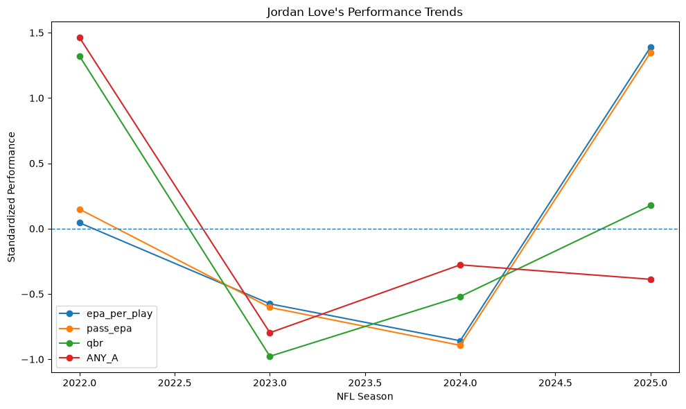
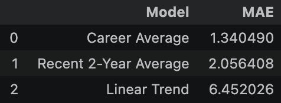
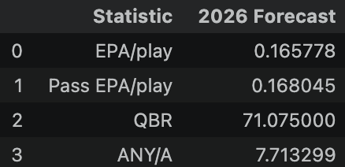
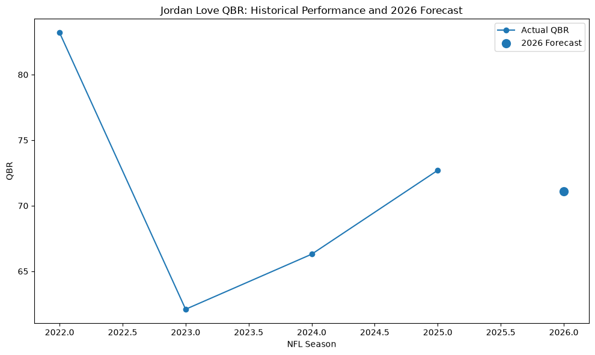
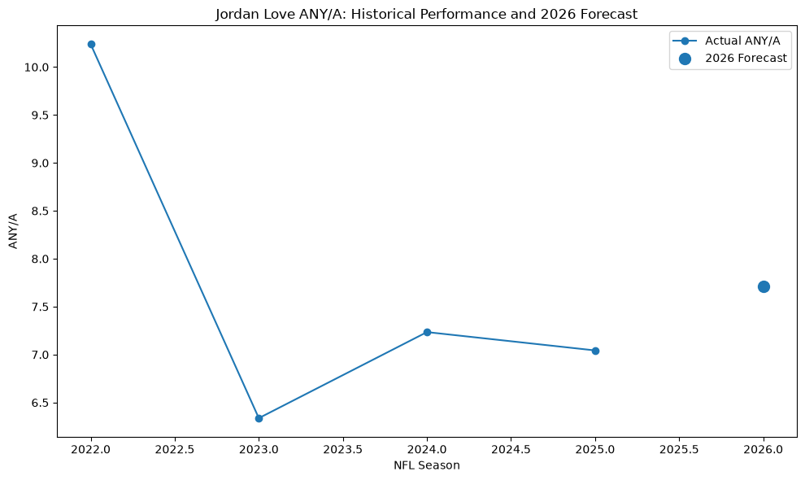

# Projects
This section documents my data science projects, research questions, and data stories I create throughout the semesters.
---
## Project 1
Research Question
What will Jordan Love's stats be for the 2026 NFL season?

This project uses historical data to estimate Jordan Love's expected 2026 performance. This analysis focuses on four quarterback performance measures: EPA per play, Pass EPA per play, QBR, and Adjusted Net Yards per Attempt (ANY/A). These stats were chosen because they analyze a quarterback in a much more advanced way rather than looking at the regular stats such as passing yards or interceptions. We want to avoid those because it does not always show the whole picture. For example some quarterback interceptions are due to a receiver juggling the ball into a defenders hands which does not reflect on a quarterbacks performance.

Dataset  
The dataset used for this project was NFL play-by-play data accessed through the nflreadpy package from nflverse. The notebook loaded data from 2018 to 2025. The dataset originally contained 389,358 plays but was brought down to 371,798 by making it only the regular season. The data was then filtered to only include Jordan Love and when looking at this it only included 2021 to 2025. Again as stated in the beginning we make the analysis based on EPA per play, Pass EPA per play, QBR, and ANY/A.  
EPA is useful because it evaluates the value of a play relative to the expected points associated with the game situation. This was calculated by summing Love's EPA for each season and dividing it by the number of plays with available EPA data. This provided a season-level measure allowing us to see things like Love's EPA/play increasing from 0.120 in 2024 to 0.239 in 2025  
Pass EPA is useful similarly to EPA but since we are looking at a quarterback it analyzing specifically the passing EPA is important. This was calculated by limiting the data to players where the pass variable was equal to 1 and EPA was available. This was then dived by the number of passing plays so for example we see his Pass EPA/play increase from 0.120 in 20240 to 0.240 in 2025.  
QBR was a little different since it was obtained from a separate season-level dataset which we also filtered to Love's regular-season results. One example of this was seeing an increase from 66.3 in 2024 to 72.7 in 2025
ANY/A was calculated using a formula which included passing yards, touchdowns, interceptions, sacks, sack yards, and passing attempts. This accounts for his passing production while incorporating touchdowns, interceptions, and sacks.  
ANY/A = (Passing Yards + 20(TD) - 45(INT) + Sack Yards) / (Attempts + Sacks)  
Some further work we did to the data was merging the datasets in which the final table would contain one observation per season. This table originally was missing a value for the QBR in 2021 so we dropped that season and on included 2022-2025. This prevented an estimated QBR value from being added to the model but also reduced the already small sample size available for forecasting.

Historical Results  

The largest improvement we see from Love is from 2024 to 2025. Everything increases except ANY/A. EPA/play and Pass EPA/play both doubled. This helps show that when analyzing a quarterbacks performance you need to look at multiple stats to paint the whole picture because looking at only one stat can show bias and leave out most of the story.

Forecasting Method  
We used three forecasting approaches: Career Average, Recent Two-Year Average, and Linear Trend. The models were tested using 2024 and 2025 as historical test seasons. Mean Absolute Error (MAE) was used to compare the approaches.  
  
The career-average method produced was the lowest MAE and was therefore selected as the best-performing forecasting method. Again since the the sample size is small we must look at this as an estimate rather than a precise prediction

Forecast  
Using the selected approach, Love's projected 2026 stats are:  
  
These forecasts reflect his historical performance rather than assuming that his most recent season will continue unchanged.

Visual 1: Jordan Love QBR  

Visual 2: Jordan Love ANY/A  

Conclusion  
Using NFL play-by-play data from 2018–2025 and Jordan Love's historical performance from 2021–2025, the analysis examined EPA/play, Pass EPA/play, QBR, and ANY/A. Three forecasting approaches were compared using historical test seasons, and the career-average approach produced the lowest MAE.  
The resulting 2026 projections are 0.166 EPA/play, 0.168 Pass EPA/play, a 71.1 QBR, and a 7.71 ANY/A.  
The results point toward a relatively stable 2026 season for Love, with performance close to his recent level and some improvement in ANY/A. However, these should be interpreted as statistical estimates rather than guarantees. The small number of season-level observations, missing 2021 QBR, and lack of variables describing injuries, teammates, coaching, and defensive strength limit the model's ability to capture all of the factors that influence quarterback performance.  
Future research could improve the analysis by incorporating additional seasons as they become available, more quarterback performance measures, opponent strength, team context, injury information, and more advanced forecasting models. A larger dataset would also make it possible to evaluate whether more complex models consistently outperform the simple career-average approach.

Sources Included Here:  
[Project 1](personalPortfolioProject1.html)
