# Projects
This section documents my data science projects, research questions, and data stories I create throughout the semesters.
---
## Project 1
Research Question
What will Jordan Love's stats be for the 2026 NFL season?

This project uses historical data to estimate Jordan Love's expected 2026 performance. This analysis focuses on four quarterback performance measures: EPA per play, Pass EPA per play, QBR, and Adjusted Net Yards per Attempt (ANY/A). These stats were chosen because they analyze a quarterback in a much more advanced way rather than looking at the regular stats such as passing yards or interceptions. We want to avoid those because it does not always show the whole picture. For example some quarterback interceptions are due to a receiver juggling the ball into a defenders hands which does not reflect on a quarterbacks performance.

Dataset  
The dataset used for this project was NFL play-by-play data accessed through the nflreadpy package from nflverse. The notebook loaded data from 2018 to 2025. The dataset originally contained 389,358 plays but was brought down to 371,798 by making it only the regular season. The data was then filtered to only include Jordan Love and when looking at this it only included 2021 to 2025. Again as stated in the beginning we make the analysis based on EPA per play, Pass EPA per play, QBR, and ANY/A.  
EPA is useful because it evaluates the value of a play relative to the expected points associated with the game situation. This was calculated by summing Love's EPA for each season and dividing it by the number of plays with available EPA data. This provided a season-level measure allowing us to see things like Love's EPA/play increasing from 0.120 in 2024 to 0.239 in 2025  
Pass EPA is useful similarly to EPA but since we are looking at a quarterback it analyzing specifically the passing EPA is important. This was calculated by limiting the data to players where the pass variable was equal to 1 and EPA was available. This was then dived by the number of passing plays so for example we see his Pass EPA/play increase from 0.120 in 20240 to 0.240 in 2025.  
QBR was a little different since it was obtained from a separate season-level dataset which we also filtered to Love's regular-season results. One example of this was seeing an increase from 66.3 in 2024 to 72.7 in 2025
ANY/A was calculated using a formula which included passing yards, touchdowns, interceptions, sacks, sack yards, and passing attempts. This accounts for his passing production while incorporating touchdowns, interceptions, and sacks.  
ANY/A = (Passing Yards + 20(TD) - 45(INT) + Sack Yards) / (Attempts + Sacks)  
Some further work we did to the data was merging the datasets in which the final table would contain one observation per season. This table originally was missing a value for the QBR in 2021 so we dropped that season and on included 2022-2025. This prevented an estimated QBR value from being added to the model but also reduced the already small sample size available for forecasting.

Historical Results  
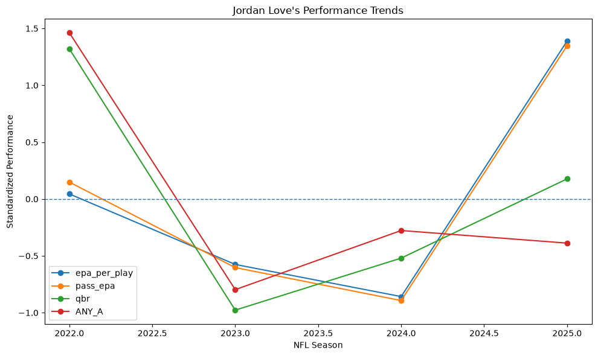
The largest improvement we see from Love is from 2024 to 2025. Everything increases except ANY/A. EPA/play and Pass EPA/play both doubled. This helps show that when analyzing a quarterbacks performance you need to look at multiple stats to paint the whole picture because looking at only one stat can show bias and leave out most of the story.

Forecasting Method  
We used three forecasting approaches: Career Average, Recent Two-Year Average, and Linear Trend. The models were tested using 2024 and 2025 as historical test seasons. Mean Absolute Error (MAE) was used to compare the approaches.  
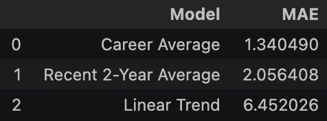  
The career-average method produced was the lowest MAE and was therefore selected as the best-performing forecasting method. Again since the the sample size is small we must look at this as an estimate rather than a precise prediction

Forecast  
Using the selected approach, Love's projected 2026 stats are:  
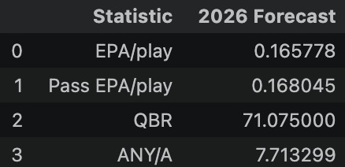  
These forecasts reflect his historical performance rather than assuming that his most recent season will continue unchanged.

Visual 1: Jordan Love QBR  
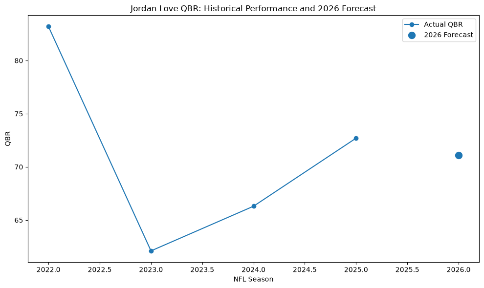

Visual 2: Jordan Love ANY/A  
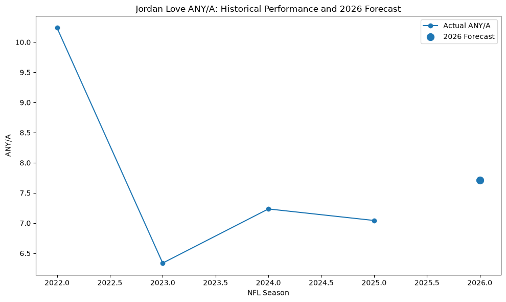

Conclusion  
Using NFL play-by-play data from 2018–2025 and Jordan Love's historical performance from 2021–2025, the analysis examined EPA/play, Pass EPA/play, QBR, and ANY/A. Three forecasting approaches were compared using historical test seasons, and the career-average approach produced the lowest MAE.  
The resulting 2026 projections are 0.166 EPA/play, 0.168 Pass EPA/play, a 71.1 QBR, and a 7.71 ANY/A.  
The results point toward a relatively stable 2026 season for Love, with performance close to his recent level and some improvement in ANY/A. However, these should be interpreted as statistical estimates rather than guarantees. The small number of season-level observations, missing 2021 QBR, and lack of variables describing injuries, teammates, coaching, and defensive strength limit the model's ability to capture all of the factors that influence quarterback performance.  
Future research could improve the analysis by incorporating additional seasons as they become available, more quarterback performance measures, opponent strength, team context, injury information, and more advanced forecasting models. A larger dataset would also make it possible to evaluate whether more complex models consistently outperform the simple career-average approach.

Sources Included Here:  
[Project 1](personalPortfolioProject1.html)

## Project 1
Research Question
How accurately can NFL game outcomes be predicted using team performance statistics available before the game?

This project uses historical NFL game data to predict whether the home team will win or lose an upcoming regular-season game. Unlike a model that uses statistics from the game itself, this project only uses information that would have been available before the game started. This makes the prediction more realistic because the goal is to see whether previous team performance can be used to predict a future game outcome. The analysis focuses on four main team performance measures: average points scored, average points allowed, average point differential, and win percentage. These statistics were chosen because they provide a simple way to measure both offensive and defensive performance while also showing how successful each team has been entering the game.

Dataset  
The dataset used for this project was NFL schedule and game data accessed through the nflreadpy package from nflverse. The analysis used regular-season games from 2021 through 2025. The unit of analysis for the final dataset was an individual NFL game.  
The original schedule data contained information about each game including the season, week, home team, away team, and final score. The dataset was filtered to only include regular-season games.  
The data was then transformed so that previous team performance could be calculated before each game. For each team, we calculated its average points scored, average points allowed, average point differential, and win percentage using only games that had already occurred earlier in that season.  
This was an important step because using statistics from the game being predicted would create data leakage. For example, when predicting a Week 8 game, the model could only use information from Weeks 1 through 7. Week 8 statistics were not included because they would not have been known before kickoff.  
The final prediction variables were created by comparing the home team and away team. For example, the points scored difference was calculated by subtracting the away team's previous average points scored from the home team's previous average points scored. The same process was used for points allowed, point differential, and win percentage.  
The target variable was whether the home team won the game. A value of 1 represented a home-team win and a value of 0 represented a home-team loss.  

Data Preparation  
Several steps were used to prepare the data before modeling. First, the dataset was limited to regular-season games. The game-level data was then separated into home and away team observations so that previous performance could be calculated for each team.  
The previous statistics were calculated using an expanding average and a one-game shift. The shift was important because it prevented the current game from being included in the team's statistics.  
Week 1 games were removed because there were no previous games within the season from which to calculate team performance.  
The final dataset contained four main features:  

Difference in average points scored.  
Difference in average points allowed.  
Difference in average point differential.  
Difference in win percentage.  

These variables were selected because they provide information about both teams while keeping the model relatively simple and interpretable.  

Historical Results  
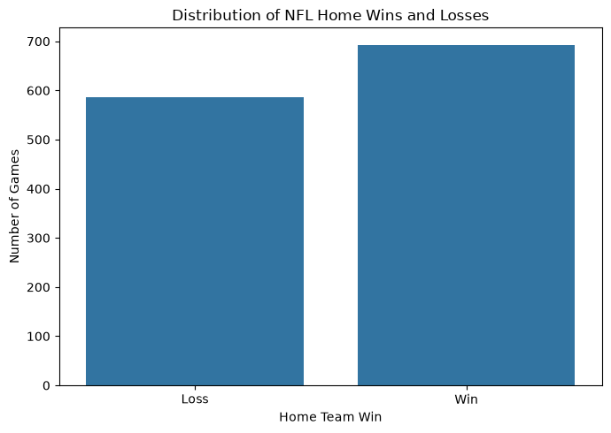  
The distribution of home wins and losses was examined before developing the models. This was important because a classification model can appear to perform well if one outcome is much more common than the other.  
The analysis also examined the relationships between the selected features and the home-team outcome. The correlation analysis helped identify which variables appeared to have the strongest relationship with winning while also showing how closely related some of the predictors were to each other.  
One important pattern was that teams with stronger previous point differentials and higher previous win percentages generally entered games with a greater likelihood of winning.  

Training and Testing Strategy  
The data was separated based on time rather than randomly. Games from 2021 through 2024 were used to train the models, while games from 2025 were used as the testing dataset.  
This approach was selected because the purpose of the project is to predict future NFL games. A random train-test split could place games from the future into the training dataset and games from the past into the testing dataset. Using 2021–2024 for training and 2025 for testing better represents how the model would work in a real-world situation.  
The model was trained using only information available before each game. The 2025 games were not used to train either model, allowing the 2025 season to serve as an independent test of model performance.  

Baseline Performance. 
A baseline model was created before testing the machine-learning models. The baseline always predicted the most common outcome in the training data.  
The baseline produced an accuracy of approximately 0.535.  
This baseline provides a point of comparison for the two machine-learning models. For a model to provide useful predictive information, it should perform better than this simple strategy.  

Model Development  
Logistic Regression  
The first model was Logistic Regression. Logistic Regression was selected because the target variable contains two possible outcomes: a home-team win or a home-team loss.  
The model estimates the probability that the home team will win based on the differences between the two teams' previous performance.  
The features were standardized before being used in the Logistic Regression model because scaling allows the model to compare variables that may have different ranges.  
Random Forest  
The second model was a Random Forest Classifier. Random Forest was selected because it can identify nonlinear relationships between variables and does not require the same feature scaling used by Logistic Regression.  
The Random Forest model was created using multiple decision trees. The results from these trees were combined to produce the final classification.  
Using both Logistic Regression and Random Forest allowed the project to compare a simpler and more interpretable model against a model capable of capturing more complicated relationships.  

Model Evaluation
The models were evaluated using accuracy, precision, recall, and F1-score.  
Accuracy measures the percentage of games that the model predicted correctly.  
Precision measures how often the model was correct when it predicted that the home team would win.  
Recall measures how many of the actual home-team wins the model was able to correctly identify.  
The F1-score combines precision and recall into one measurement and is useful for comparing the overall classification performance of the models.  
The results were:
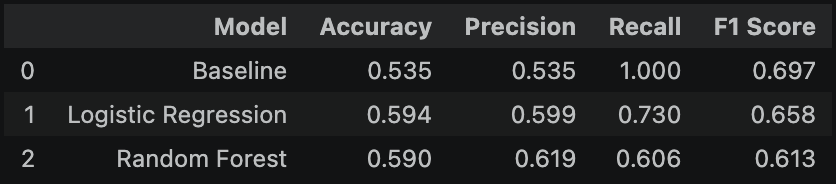  
Logistic Regression produced the highest accuracy at 59.4%, slightly outperforming Random Forest at 59.0%. Logistic Regression also had the highest recall and F1 score among the two machine-learning models.  
Random Forest produced the highest precision at 61.9%. This means that when Random Forest predicted that the home team would win, it was correct more often than Logistic Regression.  
Overall, Logistic Regression was selected as the best-performing model because it had the highest accuracy and F1 score. Both machine-learning models also improved upon the 53.5% baseline in terms of accuracy.

Confusion Matrices  
Logistic Regression Confusion Matrix  
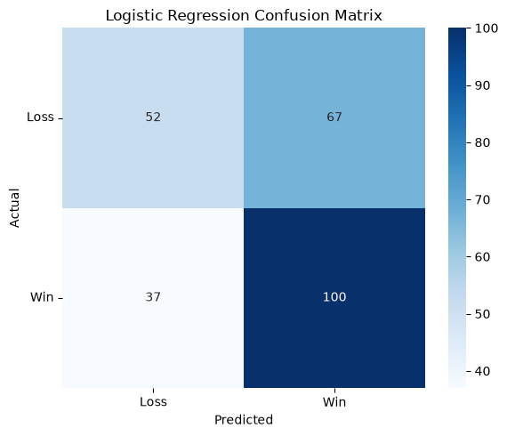  
The Logistic Regression confusion matrix shows that the model correctly predicted 52 home-team losses and 100 home-team wins. It incorrectly predicted 67 losses as wins and 37 wins as losses.  
This shows that Logistic Regression was more successful at identifying home-team wins than home-team losses.  
Random Forest Confusion Matrix  
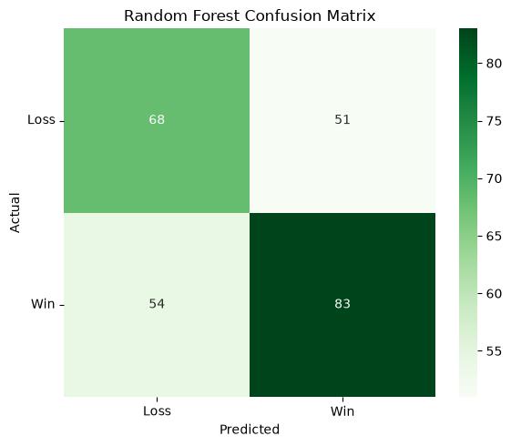  
The Random Forest model correctly predicted 68 home-team losses and 83 home-team wins. It incorrectly predicted 51 losses as wins and 54 wins as losses.  
Compared with Logistic Regression, Random Forest was better at identifying home-team losses but identified fewer home-team wins.  
The confusion matrices help explain why Logistic Regression had a higher recall while Random Forest had a higher precision.  

Model Interpretation  
Feature importance was examined for the Random Forest model to determine which variables were most useful for predicting game outcomes.  
Random Forest Feature Importance  
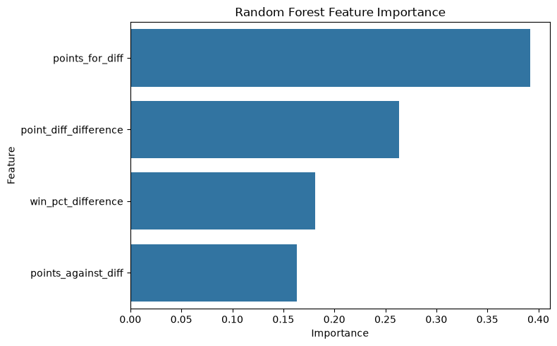  
The feature importance results showed that points_for_diff was the most important variable, followed by point_diff_difference.  
The Logistic Regression coefficients were also examined to understand the direction of the relationships.  
Logistic Regression Coefficients  
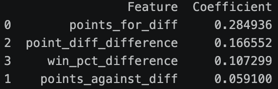  
A positive coefficient indicates that an increase in the feature was associated with a greater probability of the home team winning, while a negative coefficient indicates the opposite relationship.   

Example Predictions  
The final testing dataset was also examined at the individual game level.  
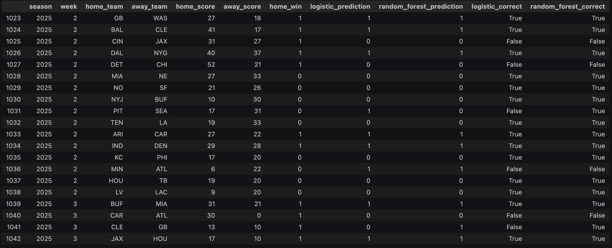  
Looking at individual predictions helps demonstrate where the models succeeded and where they struggled. NFL games can be difficult to predict because the outcome can be influenced by factors that are not included in the model, such as injuries, weather, coaching decisions, turnovers, and unexpected player performance.  

Sources Included Here:  
[Project 2](personalPortfolioProject2.html)
